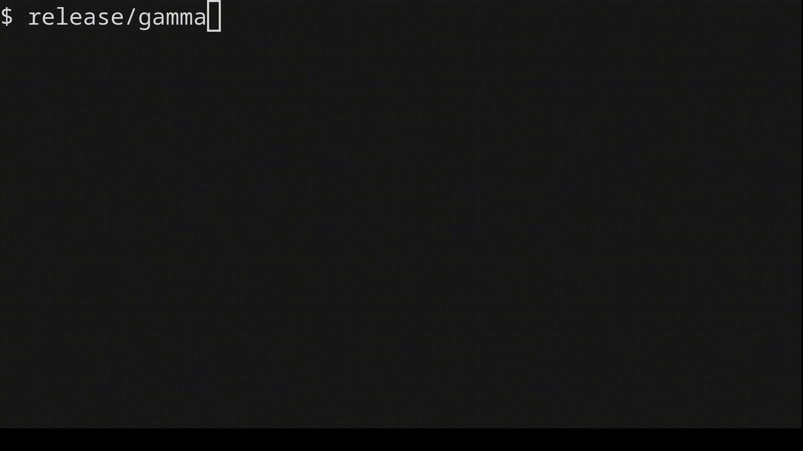

# gamma

A go-like game for the terminal

@mainpage Gamma project's documentation

## Introduction

This project implements a board game called gamma for the terminal. Although
CMake is used as the build system, the project was written for Linux, however
batch mode may still work on Windows.

## Demo



## Building

Use the following sequences of commands to build the project, starting in the
project's root directory:

```bash
mkdir release
cd debug
cmake ..
make
```

To build the project in debug mode:

```bash
mkdir debug
cd debug
cmake -D CMAKE_BUILD_TYPE=Debug ..
make
```

Make also has a `test` target which creates a `gamma_test` executable which runs
tests on the game engine. To further test with the supplied testing script,
after building the project in debug mode, run the following commands from the
project's root directory:

```bash
./test.sh debug/gamma_test debug/gamma tests
```

The script above expects [valgrind](https://valgrind.org/) to be installed.

## Game rules

### Initial setting

The game is played on a rectangular board consisting of identical square fields.
Fields are adjacent if they share an edge. Fields that share only a corner are
not considered adjacent. Fields form an area if each field can be reached from
another one by passing through adjacent fields. A single field is also an area.
One or more players can play. At the beginning of the game, the board is empty.

### Moves

Players take turns occupying fields, one at a time, by placing a piece on a
field. A player may occupy any free field, subject only to the rule that the
number of areas occupied by the player cannot, at any stage, be greater than the
maximum number of areas, which is a game parameter. Each player may make a
golden move once during the entire game, which involves removing another
player's piece from the board and placing their own piece in its place. However,
this move must not violate the rule of the maximum number of areas occupied by
any player. A player unable to make a move consistent with the above rules skips
their turn.

### Game finish

The game ends when no player can make a move. The player who
occupies the most fields wins.

## Game modes

The game can be played in two modes: interactive and batch. At the beginning of
the program it expects one of two commands:

```text
B width height players areas
I width height players areas
```

These commands specify whether the user wants to play in batch or interactive
mode respectively, and the parameters of the game instance.

### Batch mode

In batch mode, the program expects commands, each in a separate line. The type
of command is determined by the first character of the line. If the command
requires a parameter or parameters, then after that character there is a
nonempty string of white spaces, and after that further parameters appear. The
command parameters are decimal numbers. Parameters are separated by nonempty
strings of whitespace characters. At the end of the line, any number of white
spaces may occur.

The program accepts the following commands in the batch mode:

- `m player x y` – make normal move to (`x`, `y`) for `player`,
- `g player x y` – make golden move to (`x`, `y`) for `player`,
- `b player` – show number of busy fields by `player`,
- `f player` – show number of free fields to put a piece on for `player`,
- `q player` – show if `player` could perform a golden move,
- `p` – print the board.

Empty lines and lines starting with `#` are ignored. Any incorrect line not
matching the specification or with wrong parameters is met with `ERROR n`
message to `stderr` where `n` is the number of the wrong line.

In the batch mode, the program finishes when input data comes to an end.

### Interactive mode

In interactive mode, the program displays the board and a prompt for the next
player to make a move. To change position of the cursor on the board use the
arrow keys, to make normal move on the board use the spacebar, to make a golden
move use the `G` key. A player can skip their turn by pressing the `C` key.
Capslock or Shitftlock state doesn't matter for key recognition.

The game ends when no player can make a move or after pressing `Ctrl-D`. Then
the program prints the final game board along with a summary of how many fields
each player has taken.

## Further documentation

After running `cmake` in either release or debug mode, use `make doc` to
generate project's documentation locally. Install
[doxygen](https://www.doxygen.nl/) beforehand.
